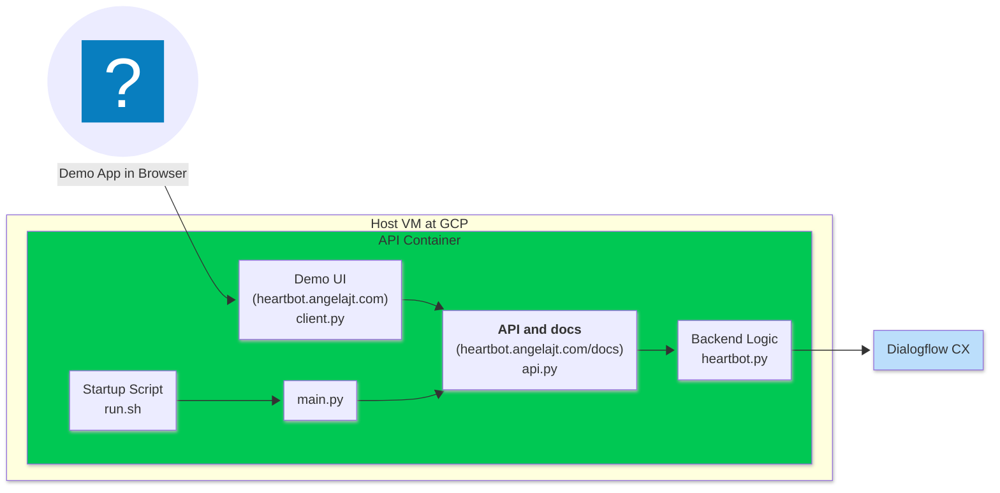

# Heartbot Backend System Architecture

## Component Descriptions

### Demo UI (`client.py`)

This is a demo UI for testing purposes, found at
[heartbot.angelajt.com](heartbot.angelajt.com). It lets us interact with the
Heartbot API through a web-based interface, accessible through a web browser.

- Communicates with api.py through JSON messages 

### API and Docs (`api.py`)

The API layer, built with FastAPI, serves the primary endpoints used by the
frontend. It also serves interactive documentation (Swagger UI) available at
[heartbot.angelajt.com/docs](heartbot.angelajt.com/docs). It acts as the bridge
between the user interface and backend logic.

**The API layer will be accessed directly by the production phone app.**

- Calls heartbot.py `chat_with_module` function

### Backend Logic (`heartbot.py`)

This is the core of the heartbot application.
- Handles Conversational Agents credential secrets, for security (we don't want
  the API key on the client side / participants' phones)
- Accesses the different module agents
- Takes user input and sends it to Conversational Agents
- Receives responses from Conversational Agents
- Handles individual chat sessions
- Parses `[image]` tags (so that the app can show images in messages)
- Parses `[end]` tags (so that we know when the user finishes a module)

The backend communicates with Conversational Agents through a secure HTTPS
connection.

### Startup Script (`run.sh`)

This is the Docker container startup script. It is responsible for setting up
the runtime environment, pulling necessary environment variables, and launching
the FastAPI server inside the container.

### Application Entrypoint (`main.py`)

This script starts up the FastAPI application defined in `api.py`.
`api.py` in turn calls `heartbot.py`, as mentioned above.

### Conversational Agents

Conversational Agents provides only the LLM functionality that `heartbot.py`
depends on. The Heartbot application itself is in `heartbot.py`.

### API Container

This is a Docker container that packages and isolates the application
components (`client.py`, `api.py`, `heartbot.py`, `main.py`, and `run.sh`).
Encapsulating everything in a Docker container enables reproducible
deployments.

### Host VM at GCP

A virtual machine running on Google Cloud Platform (GCP). It hosts the Docker
container, and serves as the infrastructure base for running Heartbot’s
application stack.
